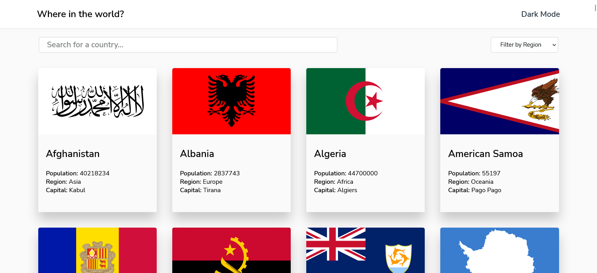
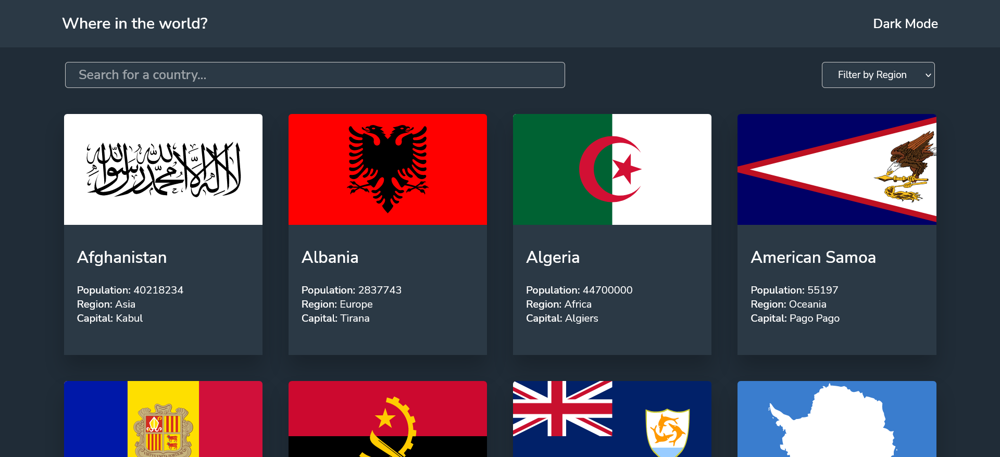
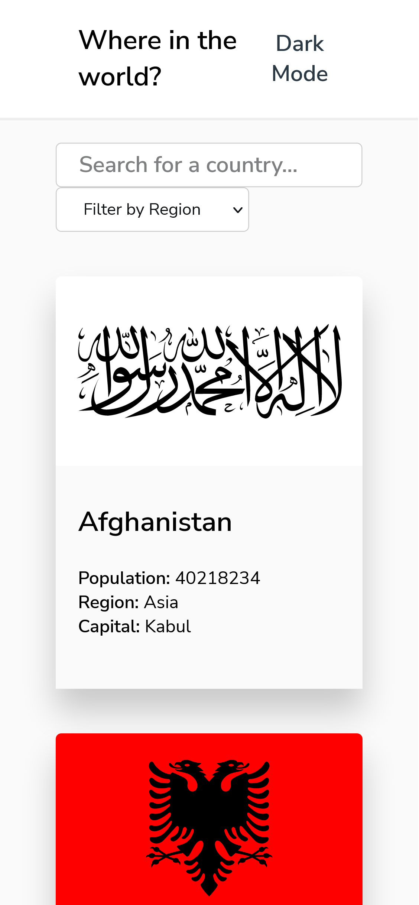
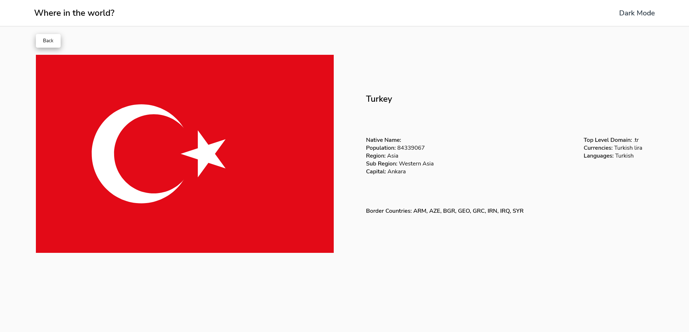
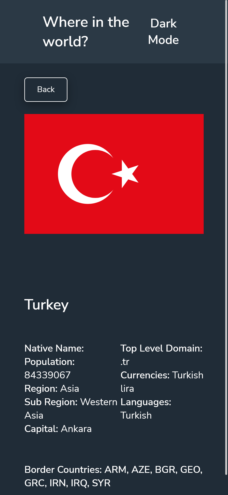

# Rest Countries API Visualization 

Live website: https://fatihbulbul1.github.io/react-rest-countries-api/

# Overview
Made by:
- **React**
- **React Hooks**
- HTML
- CSS
- CSS Grid

### Fonts
Check `style-guide.md` for detailed information.

## Description 
- This is a solution to the [REST Countries API with color theme switcher challenge on Frontend Mentor](https://www.frontendmentor.io/challenges/rest-countries-api-with-color-theme-switcher-5cacc469fec04111f7b848ca)
- Responsive REST API Countries visualization built by Vite and created by React.
- Click "Dark mode" for switch color layout.
- Filter by continental or/and including word.
- Note: Dark mode is working properly but i know that it is not best way to do it. 
- Click on a country for see full information.

### Author
- LinkedIn - [Ömer Fatih Bülbül](https://www.linkedin.com/in/ömer-fatih-bülbül-74a890236/)
- Twitter - [fatihbulbul91](https://twitter.com/fatihbulbul91)
- Frontend Mentor - [fatihbulbul1](https://www.frontendmentor.io/profile/fatihbulbul1)